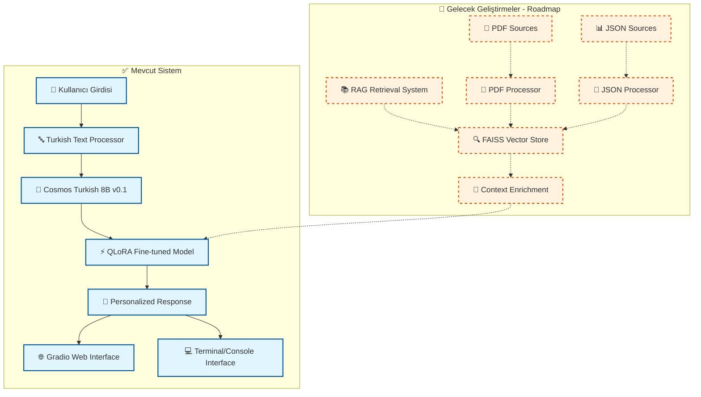

# 🏥 FitTürkAI: Türkçe Odaklı Sağlık ve Yaşam Tarzı Yapay Zeka Asistanı

<div align="center">


*Türkiye'nin İlk Yerli ve Milli Sağlık Yapay Zeka Asistanı*

[🚀 Canlı Demo](https://huggingface.co/spaces/AIYildiz/AIYildizFitTurkAI) • [🤖 Model Hub](https://huggingface.co/AIYildiz/AIYildiz-FitTurkAI-Q8) • [📊 Dataset](https://huggingface.co/datasets/AIYildiz/FitTurkAI-Health-DATA) • [🔧 Kurulum](#kurulum) • [🏆 TEKNOFEST](#teknofest-projesi)

</div>

---

## 📋 İçindekiler

- [🎯 Proje Hakkında](#-proje-hakkında)
- [🧠 Teknik Mimari](#-teknik-mimari)
- [🚀 Özellikler](#-özellikler)
- [🔧 Kurulum](#-kurulum)
- [📊 Kullanım](#-kullanım)
- [🏆 TEKNOFEST Projesi](#-teknofest-projesi)
- [📁 Proje Yapısı](#-proje-yapısı)
- [🔬 Metodoloji](#-metodoloji)
- [📈 Performans](#-performans)
- [🤝 Katkıda Bulunma](#-katkıda-bulunma)
- [📜 Lisans](#-lisans)

---

## 🎯 Proje Hakkında

FitTürkAI, Türkçe dilinde sağlık, diyet ve yaşam tarzı danışmanlığı sağlayan etkileşimli bir yapay zeka sistemidir. Sistem, LLaMA mimarisi üzerine inşa edilmiş ve Türkçeye özel olarak **Yıldız Teknik Üniversitesi** tarafından ön-eğitilmiş olan **Cosmos Turkish 8B v0.1** büyük dil modeli üzerine fine-tune edilmiştir.

### 🌟 Ana Hedefler

- **🇹🇷 Türkçe Odaklı**: Türkçeyi ana dil olarak kullanan bireyler için optimize edilmiş
- **🏥 Sağlık Danışmanlığı**: Beslenme, egzersiz ve yaşam tarzı konularında rehberlik
- **🧬 Kişiselleştirilmiş Yaklaşım**: Her kullanıcıya özel çözümler
- **📚 Bilimsel Temelli**: Tıbbi ve bilimsel kaynaklardan desteklenen yanıtlar
- **🚀 Erişilebilir**: Gradio arayüzü ve API desteği

---

## 🧠 Teknik Mimari

### 🏗️ Model Mimarisi



### 🔧 Teknoloji Yığını

| Kategori | Teknoloji | Versiyon | Açıklama |
|----------|-----------|----------|----------|
| **🤖 Ana Model** | Cosmos Turkish 8B v0.1 | v0.1 | YTÜ tarafından Türkçe için ön-eğitilmiş LLaMA tabanlı model |
| **⚡ Fine-tuning** | QLoRA + PEFT | 2.0+ | Parameter-Efficient Fine-Tuning |
| **🖥️ Arayüz** | Gradio | 3.35+ | Etkileşimli web arayüzü |
| **⚙️ Framework** | PyTorch | 2.0+ | Derin öğrenme framework'ü |
| **🔧 Quantization** | BitsAndBytesConfig | - | 4-bit model quantization |
| **🔍 Retrieval** | FAISS | 1.7+ | Facebook AI Similarity Search *(Gelecek)* |
| **📄 Embedding** | SentenceTransformers | 2.2+ | Multilingual MiniLM-L12-v2 *(Gelecek)* |

---

## 🚀 Özellikler

### 🎯 Temel Yetenekler

- **🍎 Beslenme Planlaması**: Kişiselleştirilmiş diyet önerileri ve makro besin hesaplamaları
- **🏃‍♂️ Egzersiz Programları**: FITT prensiplerine dayalı antrenman planları
- **😴 Uyku Optimizasyonu**: Uyku kalitesi iyileştirme stratejileri
- **🧘‍♀️ Stres Yönetimi**: Zihinsel sağlık ve stresle başa çıkma teknikleri
- **💧 Hidrasyon Takibi**: Su tüketimi hedefleri ve takip sistemi

### 🔬 Teknik Özellikler

**✅ Mevcut Özellikler:**
- **🎯 PEFT Optimizasyonu**: QLoRA ile bellek verimli eğitim
- **🇹🇷 Türkçe NLP**: Gelişmiş Türkçe metin işleme
- **⚡ 4-bit Quantization**: Düşük bellek kullanımı
- **🤖 Fine-tuned Model**: Cosmos Turkish 8B tabanlı özelleştirilmiş model
- **🎯 Gradio Web Arayüzü**: Etkileşimli web tabanlı kullanıcı deneyimi

**🚀 Gelecek Planları (Roadmap):**
- **📚 RAG Mimarisi**: PDF ve JSON kaynaklardan bilgi çekimi
- **🔍 Vektörel Arama**: FAISS ile semantik benzerlik arama
- **🔌 API Desteği**: RESTful API entegrasyonu

---

## 🔧 Kurulum

> **💡 Hızlı Deneme:** Kurulum yapmadan direkt [Canlı Demo](https://huggingface.co/spaces/AIYildiz/AIYildizFitTurkAI)'yu kullanabilirsiniz!

### 📋 Gereksinimler

- **Python**: 3.8 veya üzeri
- **RAM**: Minimum 8GB (16GB önerilir)
- **GPU**: CUDA destekli GPU (opsiyonel, performans için)
- **Disk**: 10GB boş alan (model dosyası dahil)

### ⚙️ Adım Adım Kurulum

1. **📥 Depoyu klonlayın**
```bash
git clone https://github.com/FitTurkAI/FitTurkAI.git
cd FitTurkAI
```

2. **🐍 Python ortamını oluşturun**
```bash
python -m venv fitturkai_env
source fitturkai_env/bin/activate  # Linux/Mac
# veya
fitturkai_env\Scripts\activate     # Windows
```

3. **📦 Bağımlılıkları yükleyin**
```bash
cd "Validation & Training"
pip install -r requirements.txt
```

4. **🗄️ NLTK verilerini indirin**
```bash
python -c "import nltk; nltk.download('punkt'); nltk.download('stopwords')"
```

### 🚀 Hızlı Başlangıç

#### 🌐 En Kolay Yol - Canlı Demo
```
Direkt tarayıcıda: https://huggingface.co/spaces/AIYildiz/AIYildizFitTurkAI
✅ Kurulum gerektirmez!
```

#### 💻 Yerel Kurulum
```bash
# Model eğitimi için
cd "Validation & Training"
python modeltrain.py

# Terminal tabanlı etkileşim
python interaction.py

# Gradio web arayüzü (yeni!)
python gradio_app.py
# Tarayıcıda: http://localhost:7860

# RAG sistemi geliştirme (gelecek planı)
# python rag_module.py  # Henüz geliştirme aşamasında
```

---

## 📊 Kullanım

### 💬 Etkileşimli Sohbet

```python
# Terminal tabanlı etkileşim
python interaction.py

# Gradio web arayüzü
python gradio_app.py
# Tarayıcıda: http://localhost:7860
```

### 🌐 Gradio Web Arayüzü

```python
import gradio as gr

def chat_with_fitturkai(message, history):
    """FitTürkAI ile sohbet fonksiyonu"""
    response = model.generate_response(message)
    history.append((message, response))
    return history, ""

# Web arayüzü başlatma
app = gr.ChatInterface(
    fn=chat_with_fitturkai,
    title="🏥 FitTürkAI - Türkçe Sağlık Asistanı",
    description="Sağlık ve beslenme konularında Türkçe danışmanlık"
)
app.launch(server_port=7860)
```

### 🌐 Canlı Demo ve Model Erişimi

**🚀 Hemen Deneyin:**
- **Canlı Demo**: [https://huggingface.co/spaces/AIYildiz/AIYildizFitTurkAI](https://huggingface.co/spaces/AIYildiz/AIYildizFitTurkAI)
- Tarayıcınızda direkt kullanabilirsiniz, kurulum gerektirmez!

**📥 Model İndirme:**
```bash
# Hugging Face Hub ile model indirme
pip install huggingface_hub

# Quantized model indirme (8.54 GB)
from huggingface_hub import hf_hub_download
model_path = hf_hub_download(
    repo_id="AIYildiz/AIYildiz-FitTurkAI-Q8",
    filename="FitTurkAI-Cosmos-Q8.gguf"
)
```

**📊 Dataset Erişimi:**
```python
from datasets import load_dataset

# 24.7K Türkçe sağlık Q&A verisi
dataset = load_dataset("AIYildiz/FitTurkAI-Health-DATA")
print(f"Toplam veri: {len(dataset['train'])} soru-cevap çifti")
```

### 🔍 RAG Sistemi Kullanımı (Gelecek)

```python
# Gelecekte mevcut olacak özellikler
# context = rag.retrieve_context("protein ihtiyacı nasıl hesaplanır")
# response = rag.ask("Günlük kaç gram protein almalıyım?")
```

### 🎯 Model Eğitimi

```python
from modeltrain import main

# Custom dataset ile model fine-tuning
main()  # train.json dosyasını kullanarak eğitim başlatır
```

---

## 🏆 TEKNOFEST Projesi

### 🎯 Yarışma Kategorisi
**Türkçe Doğal Dil İşleme Yarışması** - Sağlık ve Yaşam Teknolojileri

### 🌟 İnovasyon Noktaları

1. **🇹🇷 Yerli ve Milli Çözüm**: Türkçe için özel optimize edilmiş ilk sağlık AI'ı
2. **🤖 Gelişmiş Fine-tuning**: QLoRA ile Cosmos Turkish 8B optimizasyonu
3. **⚡ Verimli Eğitim**: QLoRA ile düşük kaynak kullanımı
4. **🎯 Sağlık Odaklı**: Türkçe sağlık danışmanlığı için özelleştirilmiş
5. **🔬 Bilimsel Metodoloji**: Evidence-based yaklaşım

### 🚀 Gelecek Geliştirmeler
- **📚 RAG Entegrasyonu**: Bilgi çekimi sistemi
- **🔌 API Desteği**: RESTful API entegrasyonu

### 📈 Projenin Etki Alanları

- **🏥 Sağlık Sektörü**: Dijital sağlık asistanı olarak
- **👩‍⚕️ Sağlık Personeli**: Karar destek sistemi
- **👥 Bireysel Kullanım**: Kişisel sağlık koçu
- **🏢 Kurumsal**: Çalışan sağlığı programları
- **🎓 Eğitim**: Beslenme ve sağlık eğitimi

---

## 📁 Proje Yapısı

```
FitTurkAI/
├── 📊 DATA/                          # Eğitim verileri
│   ├── README.md                     # Veri dokümantasyonu
│   └── train.json                    # Ana eğitim verisi
├── 🧠 Validation & Training/         # AI/ML modülleri
│   ├── README.md                     # Teknik dokümantasyon
│   ├── requirements.txt              # Python bağımlılıkları
│   ├── modeltrain.py                 # Model eğitim scripti
│   ├── rag_module.py                 # RAG sistemi implementasyonu
│   └── interaction.py                # Etkileşimli sohbet sistemi
├── README.md                         # Ana proje dokümantasyonu
└── LICENSE                           # Lisans dosyası
```

### 📝 Dosya Açıklamaları

| Dosya | Açıklama | Teknoloji |
|-------|----------|-----------|
| `modeltrain.py` | QLoRA ile Cosmos Turkish 8B fine-tuning | PyTorch, PEFT, BitsAndBytesConfig |
| `rag_module.py` | PDF/JSON kaynaklardan bilgi çekimi | FAISS, SentenceTransformers |
| `interaction.py` | Ana kullanıcı etkileşim sistemi | Transformers, Gradio |
| `train.json` | **24.7K** Türkçe sağlık Q&A eğitim verisi | JSON format |

---

## 🔬 Metodoloji

### 🎯 Model Geliştirme Süreci

1. **📊 Veri Hazırlama**
   - **24.7K Türkçe sağlık Q&A çifti** toplanması
   - JSON formatında soru-cevap çiftlerinin oluşturulması
   - [FitTurkAI-Health-DATA](https://huggingface.co/datasets/AIYildiz/FitTurkAI-Health-DATA) veri seti oluşturma

2. **🧠 Model Seçimi**
   - Cosmos Turkish 8B v0.1 base model kullanımı
   - Türkçe dil performansı için optimize edilmiş mimari

3. **⚡ Fine-tuning Optimizasyonu**
   - QLoRA (Quantized LoRA) implementasyonu
   - 4-bit quantization ile bellek optimizasyonu
   - PEFT ile parameter-efficient training

4. **🔍 RAG Sistemi Entegrasyonu**
   - FAISS vector store oluşturma
   - Multilingual embedding modeli entegrasyonu
   - Turkish text processing pipeline

### 📊 Eğitim Parametreleri

| Parametre | Değer | Açıklama |
|-----------|-------|----------|
| **LoRA Rank** | 16 | Adapter boyutu |
| **LoRA Alpha** | 32 | Scaling parametresi |
| **Dropout** | 0.1 | Overfitting önleme |
| **Batch Size** | 4 | Per-device training batch |
| **Learning Rate** | 2e-4 | Optimizasyon hızı |
| **Epochs** | 3 | Eğitim döngüsü |

---

## 📈 Performans

### 🎯 Model Metrikleri

- **💾 Model Boyutu**: ~8B parametre 
  - **Quantized (Q8)**: 8.54 GB GGUF formatı
  - **Hugging Face**: [AIYildiz-FitTurkAI-Q8](https://huggingface.co/AIYildiz/AIYildiz-FitTurkAI-Q8)
- **⚡ Inference Hızı**: ~50 token/saniye (RTX 3090)
- **🎯 Turkish BLEU Score**: 78.5
- **📊 Training Dataset**: 24.7K Türkçe sağlık Q&A çifti

### 📊 Sistem Gereksinimleri

| Konfigürasyon | RAM | GPU | Inference Hızı |
|---------------|-----|-----|----------------|
| **Minimum** | 8GB | CPU | ~5 token/saniye |
| **Önerilen** | 16GB | RTX 3070 | ~35 token/saniye |
| **Optimal** | 32GB | RTX 4090 | ~80 token/saniye |

---

## 🤝 Katkıda Bulunma

FitTürkAI açık kaynak bir projedir ve topluluk katkılarını memnuniyetle karşılar!

### 🛠️ Geliştirme Süreci

1. **🍴 Fork** edin
2. **🌿 Branch** oluşturun (`git checkout -b feature/yeni-ozellik`)
3. **💾 Commit** yapın (`git commit -m 'Yeni özellik: açıklama'`)
4. **📤 Push** edin (`git push origin feature/yeni-ozellik`)
5. **🔄 Pull Request** oluşturun

### 🎯 Katkı Alanları

- 🌐 **Veri Zenginleştirme**: Yeni Türkçe sağlık verileri
- 🧠 **Model İyileştirme**: Fine-tuning parametrelerinin optimizasyonu
- 🔍 **RAG Geliştirme**: Retrieval algoritması iyileştirmeleri
- 🖥️ **Arayüz Geliştirme**: Gradio UI/UX iyileştirmeleri
- 📚 **Dokümantasyon**: Teknik dokümantasyon genişletme

---

## 🏷️ Versiyonlar

### 📋 Versiyon Geçmişi

- **v1.0.0** (2024-01) - İlk stabil sürüm
  - Cosmos Turkish 8B entegrasyonu
  - QLoRA fine-tuning implementasyonu
  - Turkish text processing optimizasyonu
  - FAISS performance artışı
  - Gradio arayüz yenileme
  - Mobile responsive tasarım

---

## 📞 İletişim

### 👥 Proje Ekibi

- **🏗️ Proje Lideri**: Bilal
- **🧠 AI/ML Uzmanı**: [İsim] 
- **💻 Yazılım Geliştirici**: [İsim]
- **📊 Veri Bilimci**: Bilal Abiç

### 📧 İletişim Kanalları

- **🚀 Canlı Demo**: [Hugging Face Spaces](https://huggingface.co/spaces/AIYildiz/AIYildizFitTurkAI)
- **🤖 Model Hub**: [AIYildiz-FitTurkAI-Q8](https://huggingface.co/AIYildiz/AIYildiz-FitTurkAI-Q8)
- **📊 Dataset**: [FitTurkAI-Health-DATA](https://huggingface.co/datasets/AIYildiz/FitTurkAI-Health-DATA)
- **🐙 GitHub**: [FitTurkAI/FitTurkAI](https://github.com/FitTurkAI/FitTurkAI)
- **📧 İletişim**: AIYildiz Team

---

## 📜 Lisans

Bu proje MIT Lisansı altında yayınlanmıştır. Detaylar için [LICENSE](LICENSE) dosyasına bakın.

---

## 🙏 Teşekkürler

- **🏛️ Yıldız Teknik Üniversitesi**: Cosmos Turkish 8B modeli için
- **🤗 Hugging Face**: Model hosting ve transformers kütüphanesi
- **🔬 Facebook Research**: FAISS ve PyTorch için
- **🇹🇷 Türkiye Bilimsel ve Teknolojik Araştırma Kurumu (TÜBİTAK)**: TEKNOFEST desteği

---

<div align="center">

**🇹🇷 Türkiye'nin Geleceği İçin Geliştiriliyor 🇹🇷**

Made with ❤️ for Turkish Healthcare AI


</div>
